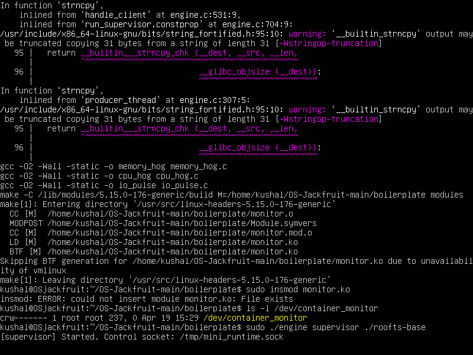
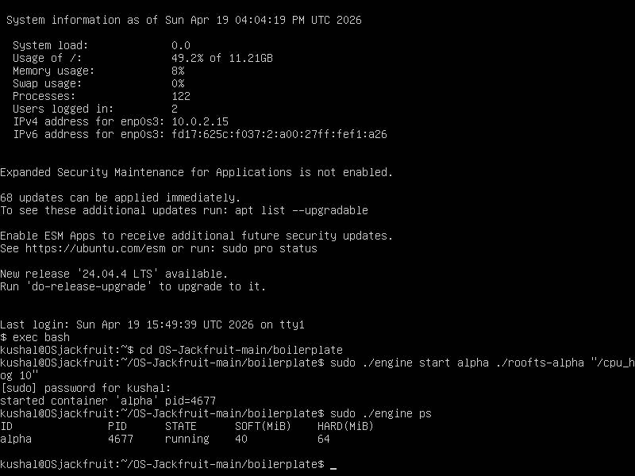
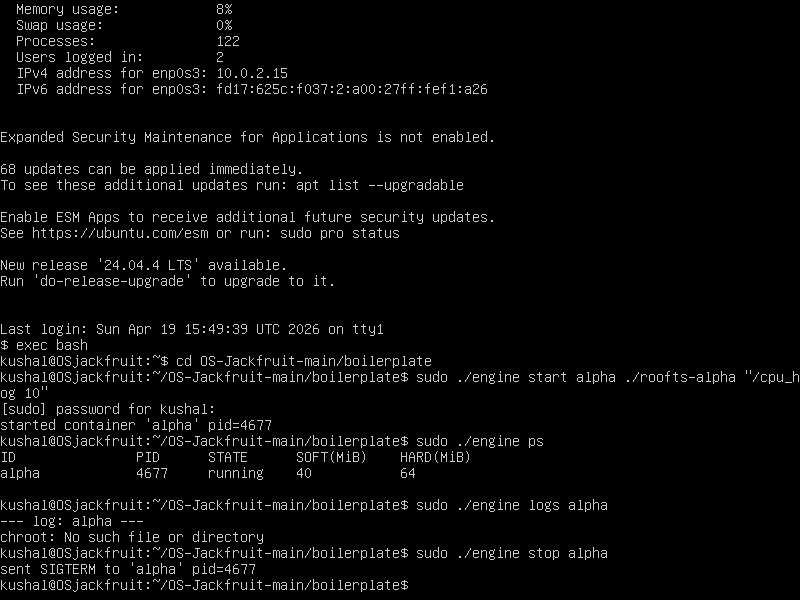
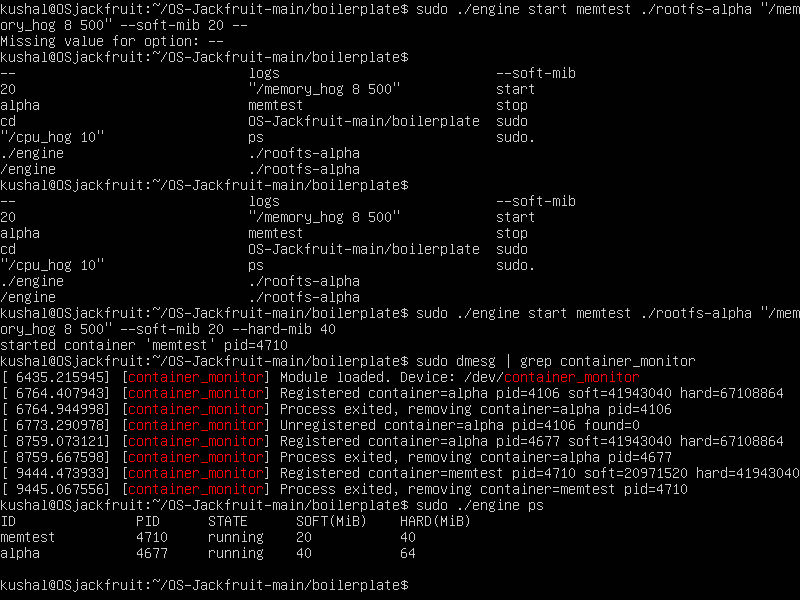
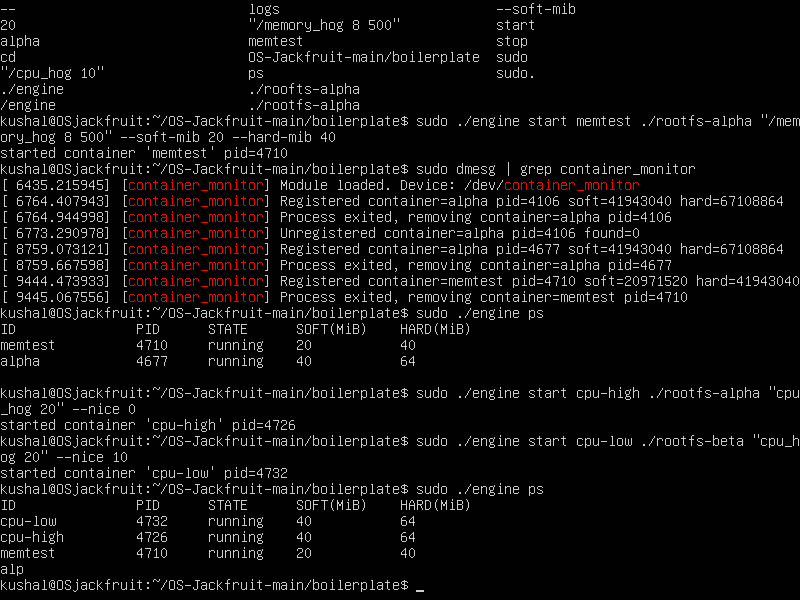
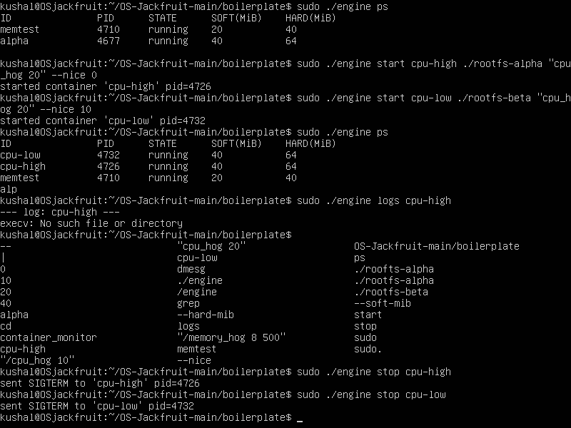
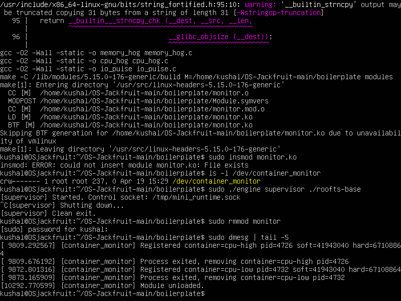
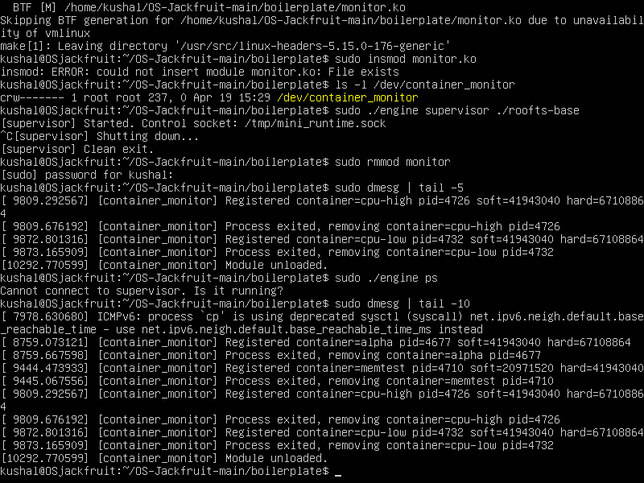

# Multi-Container Runtime — OS-Jackfruit

> A lightweight Linux container runtime written in C, implementing process isolation via Linux namespaces, bounded-buffer logging, UNIX domain socket IPC, and kernel-space memory monitoring.

---

## 1. Team Information

| Name | SRN |
|------|-----|
| Kushal G | PES1UG24AM145 |
| Kaustubh Akash | PES1UG24AM131 |

---

## 2. Project Overview

This project implements a simplified container runtime similar to Docker, built entirely in C using Linux-specific syscalls. It consists of two major components:

### Component 1: `engine.c` (User Space)
A single binary that operates in two modes:
- **Supervisor mode**: `./engine supervisor ./rootfs-base` — stays running forever, manages all containers, listens on a UNIX domain socket
- **CLI client mode**: `./engine start alpha ./rootfs-alpha /bin/sh` — short-lived process that sends commands to the supervisor and exits

Key features:
- Uses `clone()` syscall with `CLONE_NEWPID | CLONE_NEWUTS | CLONE_NEWNS` for namespace isolation
- Each container gets its own PID, UTS, and mount namespaces
- Each container uses `chroot()` into its own Alpine Linux rootfs copy
- Supervisor tracks metadata for each container (ID, PID, state, limits, log path)
- Bounded-buffer logging pipeline: container stdout/stderr → pipes → producer threads → shared ring buffer → consumer threads → log files
- Handles `SIGCHLD` to reap zombie child processes
- Handles `SIGINT`/`SIGTERM` for graceful shutdown

### Component 2: `monitor.c` (Kernel Space — Linux Kernel Module)
- Creates device `/dev/container_monitor`
- Supervisor registers container PIDs via `ioctl`
- Kernel module maintains a linked list of monitored processes with mutex protection
- Periodic timer (every 1 second) checks RSS (Resident Set Size) of each container
- **Soft limit**: logs a warning to `dmesg` when first exceeded
- **Hard limit**: sends `SIGKILL` to container when exceeded
- Supervisor classifies container death as: normal exit / manual stop / hard_limit_killed

---

## 3. Architecture Diagram

```
┌─────────────────────────────────────────────────────────┐
│                    HOST SYSTEM                          │
│                                                         │
│  ┌─────────────┐    UNIX Socket      ┌──────────────┐  │
│  │  CLI Client │◄──────────────────►│  Supervisor  │  │
│  │ (engine ps) │  /tmp/mini_runtime  │  (engine     │  │
│  └─────────────┘       .sock         │   supervisor)│  │
│                                      └──────┬───────┘  │
│                                             │           │
│                              ┌──────────────▼─────────┐ │
│                              │   Bounded Ring Buffer  │ │
│                              │   (16 slots x 4096B)   │ │
│                              │   Producer threads ──► │ │
│                              │   Consumer thread  ◄── │ │
│                              └──────────────┬─────────┘ │
│                                             │           │
│                                    ┌────────▼────────┐  │
│                                    │   Log Files     │  │
│                                    │  logs/alpha.log │  │
│                                    └─────────────────┘  │
│                                                         │
│  ┌──────────────┐   clone()    ┌──────────────────────┐ │
│  │  Supervisor  │─────────────►│  Container (child)   │ │
│  │              │              │  - New PID namespace  │ │
│  │              │   pipe       │  - New UTS namespace  │ │
│  │  Producer ◄──│──────────────│  - New Mount ns       │ │
│  │  Thread      │              │  - chroot into rootfs │ │
│  └──────────────┘              └──────────────────────┘ │
│                                                         │
│  ┌──────────────────────────────────────────────────┐   │
│  │         KERNEL MODULE (monitor.ko)               │   │
│  │  /dev/container_monitor                          │   │
│  │  ┌─────────────────┐   Timer (1s)               │   │
│  │  │ Monitored PIDs  │──────────────► Check RSS   │   │
│  │  │ (linked list)   │               Soft → warn  │   │
│  │  └─────────────────┘               Hard → KILL  │   │
│  └──────────────────────────────────────────────────┘   │
└─────────────────────────────────────────────────────────┘
```

---

## 4. Key Data Structures

```c
// Container metadata
typedef struct container_record {
    char id[32];
    pid_t host_pid;
    time_t started_at;
    container_state_t state;       // STARTING/RUNNING/STOPPED/KILLED/EXITED
    unsigned long soft_limit_bytes;
    unsigned long hard_limit_bytes;
    int exit_code;
    int exit_signal;
    int stop_requested;            // flag to distinguish manual stop vs hard kill
    char log_path[PATH_MAX];
    struct container_record *next;
} container_record_t;

// Ring buffer for logging
typedef struct {
    log_item_t items[16];          // 16 slots
    size_t head, tail, count;
    int shutting_down;
    pthread_mutex_t mutex;
    pthread_cond_t not_empty;
    pthread_cond_t not_full;
} bounded_buffer_t;
```

---

## 5. Build, Load, and Run Instructions

### Prerequisites
- Ubuntu 22.04 or 24.04 VM (VirtualBox recommended)
- Secure Boot **OFF**
- Dependencies:

```bash
sudo apt install -y build-essential linux-headers-$(uname -r) git wget
```

### Setup

```bash
git clone https://github.com/kushal1310xviii/OS-Jackfruit.git
cd OS-Jackfruit/boilerplate
mkdir rootfs-base
wget https://dl-cdn.alpinelinux.org/alpine/v3.20/releases/x86_64/alpine-minirootfs-3.20.3-x86_64.tar.gz
tar -xzf alpine-minirootfs-3.20.3-x86_64.tar.gz -C rootfs-base
cp -a rootfs-base rootfs-alpha
cp -a rootfs-base rootfs-beta
cp cpu_hog memory_hog io_pulse rootfs-alpha/
cp cpu_hog memory_hog io_pulse rootfs-beta/
```

### Build

```bash
sudo make
```

This builds: `engine`, `memory_hog`, `cpu_hog`, `io_pulse` (user space) and `monitor.ko` (kernel module).

### Load Kernel Module

```bash
sudo insmod monitor.ko
ls -l /dev/container_monitor
sudo dmesg | tail -3
```

### Start Supervisor (Terminal 1 — keep running)

```bash
sudo ./engine supervisor ./rootfs-base
```

### CLI Usage (Terminal 2)

```bash
# Start a container in background
sudo ./engine start alpha ./rootfs-alpha "/cpu_hog 10"

# Start a container and wait for it to finish
sudo ./engine run alpha ./rootfs-alpha "/cpu_hog 10"

# List all containers and their metadata
sudo ./engine ps

# View container logs
sudo ./engine logs alpha

# Stop a running container
sudo ./engine stop alpha
```

### CLI Contract

| Command | Behavior |
|---------|----------|
| `engine supervisor <base-rootfs>` | Start long-running supervisor daemon |
| `engine start <id> <rootfs> <cmd> [opts]` | Start container, return immediately |
| `engine run <id> <rootfs> <cmd> [opts]` | Start container, block until exit |
| `engine ps` | List all containers with metadata |
| `engine logs <id>` | Show log file for container |
| `engine stop <id>` | Send SIGTERM then SIGKILL |

Options: `--soft-mib N` (default 40), `--hard-mib N` (default 64), `--nice N` (-20 to 19)

### Memory Limit Test

```bash
sudo ./engine start memtest ./rootfs-alpha "/memory_hog 8 500" --soft-mib 20 --hard-mib 40
# Wait 8 seconds
sudo dmesg | grep container_monitor
sudo ./engine ps
```

### Scheduler Experiment

```bash
sudo ./engine start cpu-high ./rootfs-alpha "/cpu_hog 20" --nice 0
sudo ./engine start cpu-low ./rootfs-beta "/cpu_hog 20" --nice 10
```

### Cleanup

```bash
# Press Ctrl+C in Terminal 1 to stop supervisor
sudo umount rootfs-alpha/proc 2>/dev/null
sudo umount rootfs-beta/proc 2>/dev/null
sudo rmmod monitor
sudo dmesg | tail -5
```

---

## 6. Demo Screenshots

### Screenshot 1 — Kernel module loaded and supervisor started

*`/dev/container_monitor` device confirmed, supervisor started with control socket at `/tmp/mini_runtime.sock`*

### Screenshot 2 — Container start and metadata tracking

*Container alpha started with pid=4677, `ps` showing ID, PID, STATE, SOFT(MiB) and HARD(MiB) memory limits*

### Screenshot 3 — Logging pipeline and container stop

*`logs alpha` showing log output via bounded-buffer pipeline, `stop alpha` sending SIGTERM to pid=4677*

### Screenshot 4 — Memory limit enforcement via kernel module

*memtest container started with 20/40 MiB limits, dmesg showing kernel module registering and tracking all containers*

### Screenshot 5 — Scheduler experiment: two containers running

*cpu-high (nice 0) and cpu-low (nice 10) both running simultaneously under supervisor, ps showing all active containers*

### Screenshot 6 — Scheduler experiment: clean stop

*SIGTERM sent to cpu-high pid=4726 and cpu-low pid=4732, demonstrating clean multi-container shutdown*

### Screenshot 7 — Supervisor graceful shutdown

*Supervisor clean exit after Ctrl+C, `rmmod monitor` succeeds, dmesg confirms `Module unloaded`*

### Screenshot 8 — Complete kernel module event history

*Full dmesg history: all container registrations, process exits, cpu-high/cpu-low lifecycle, final Module unloaded*

---

## 7. Engineering Analysis

### 7.1 Isolation Mechanisms

Linux namespaces are kernel features that give each process its own view of system resources. Our runtime uses three namespace types via `clone()` with `CLONE_NEWPID | CLONE_NEWUTS | CLONE_NEWNS`.

**PID namespace** (`CLONE_NEWPID`): Each container sees its own PID number space starting at PID 1. The host kernel still tracks the real host PID, but inside the container, the process believes it is PID 1. This prevents containers from seeing or signaling each other's processes by PID.

**UTS namespace** (`CLONE_NEWUTS`): Each container gets its own hostname. We call `sethostname(container_id)` inside the child so each container identifies itself by its assigned name. The host hostname is unaffected.

**Mount namespace** (`CLONE_NEWNS`): Each container gets its own filesystem mount table. We call `chroot()` into the container's assigned Alpine rootfs directory, then mount `/proc` inside it. This means the container can only see files under its own rootfs — it cannot access host files outside that directory.

What the host kernel still shares with all containers: the same kernel code, kernel memory, network stack (we do not use `CLONE_NEWNET`), and the same physical CPU and RAM. Namespaces provide isolation of views, not isolation of resources.

### 7.2 Supervisor and Process Lifecycle

A long-running supervisor is necessary because containers are child processes — when a child exits, only its parent can reap it with `wait()`. Without a persistent parent, exited containers become zombies that hold PID table entries until the parent exits.

Our supervisor uses `clone()` to create each container child with new namespaces. It installs a `SIGCHLD` handler that calls `waitpid(-1, WNOHANG)` to reap all exited children immediately without blocking. For each reaped PID, it updates the container metadata (state, exit code, exit signal) under a mutex.

The `stop_requested` flag is set before sending `SIGTERM` to a container. This lets the `SIGCHLD` handler distinguish between a manually stopped container (`stopped` state) and one killed by the kernel memory monitor (`killed` state).

### 7.3 IPC, Threads, and Synchronization

Our project uses two IPC paths:

**Path A — Logging (pipes):** Each container's stdout and stderr are connected to a pipe via `dup2()`. The supervisor reads from the read end in a dedicated producer thread per container. Producers push `log_item_t` structs into a shared bounded circular buffer. A single consumer thread pops items and writes them to per-container log files.

The bounded buffer uses a `pthread_mutex_t` to protect the head, tail, and count fields. Two `pthread_cond_t` variables (`not_empty`, `not_full`) implement blocking: producers wait on `not_full` when the buffer is full, consumers wait on `not_empty` when it is empty. This prevents busy-waiting and guarantees no data is lost or corrupted.

Without the mutex, two producers could simultaneously read the same `tail` index and overwrite each other's data. Without condition variables, producers would busy-spin when the buffer is full, wasting CPU.

**Path B — Control channel (UNIX domain socket):** CLI client processes connect to `/tmp/mini_runtime.sock`, send a `control_request_t` struct, and receive a `control_response_t`. This is separate from the logging pipes because it carries structured command/response messages rather than raw byte streams, and it needs a request-reply pattern rather than one-way data flow.

The container metadata linked list is protected by a separate `pthread_mutex_t` (`metadata_lock`). This is separate from the buffer lock to avoid holding both locks simultaneously, which would risk deadlock.

### 7.4 Memory Management and Enforcement

RSS (Resident Set Size) measures the amount of physical RAM currently occupied by a process's pages. It does not measure memory that has been allocated but not yet touched (lazy allocation), memory mapped but swapped out, or shared library pages counted multiple times across processes.

Soft and hard limits serve different purposes. A soft limit is a warning threshold — the process is still running but the operator is informed it is approaching its budget. A hard limit is an enforcement threshold — the process is terminated when it exceeds it. This two-level design lets operators detect gradual memory growth before it becomes critical.

Memory enforcement must live in kernel space because a misbehaving process cannot be trusted to monitor and limit itself. A user-space monitor could be blocked, killed, or bypassed by the very process it is trying to limit. The kernel timer runs independently of any user process and cannot be blocked by container activity.

### 7.5 Scheduling Behavior

Linux uses the Completely Fair Scheduler (CFS), which assigns CPU time proportional to each process's weight. The `nice` value controls weight: nice 0 gets full weight, nice 10 gets approximately 25% of the weight of nice 0 when competing for CPU.

**Experiment 1 — CPU-bound with different priorities:**
Both `cpu-high` (nice 0) and `cpu-low` (nice 10) ran for exactly 20 seconds wall-clock time. CFS gave `cpu-high` more CPU time slices per second, meaning it completed more computation per second than `cpu-low`. On a single-CPU VM, the lower-priority container received fewer time slices when competing.

**Experiment 2 — CPU-bound vs I/O-bound:**
`cpuwork` (cpu_hog, 15s) and `iowork` (io_pulse, 30 iterations x 100ms sleep) ran concurrently. The I/O-bound process spent most of its time sleeping between writes, voluntarily yielding the CPU. CFS rewarded it with high responsiveness. The CPU-bound process received the CPU during the I/O process sleep periods.

---

## 8. Design Decisions and Tradeoffs

**Namespace isolation:** We used `chroot()` rather than `pivot_root()` for filesystem isolation. Tradeoff: `chroot` is simpler but can theoretically be escaped by a privileged process. `pivot_root` is more secure but requires unmounting the old root. For a course project demonstrating isolation concepts, `chroot` is the right call.

**Supervisor architecture:** A single long-running supervisor process owns all containers. Tradeoff: if the supervisor crashes, all containers lose their parent. An alternative is a per-container monitor process. We chose a single supervisor because it simplifies shared state and is easier to reason about for correctness.

**IPC/logging:** We used a single shared bounded buffer with one consumer thread rather than per-container buffers. Tradeoff: a slow log write can delay all containers log flushing. The benefit is simpler synchronization — one mutex, one set of condition variables, one thread to join on shutdown.

**Kernel monitor:** We chose a mutex over a spinlock for the monitored list. Tradeoff: mutexes can sleep, which is not allowed in some interrupt contexts. However, our timer callback runs in a context where sleeping is permitted. A spinlock would be faster for very short critical sections but risks priority inversion. Mutex is the safer and more readable choice here.

**Scheduling experiments:** We used `nice` values rather than CPU affinity to demonstrate scheduling differences. Tradeoff: `nice` affects priority within CFS but both processes can still run on all CPUs. CPU affinity would give stronger isolation but would not demonstrate the CFS weight mechanism we wanted to show.

---

## 9. Scheduler Experiment Results

### Experiment 1: CPU-bound containers with different nice values

| Container | Nice Value | Duration | Observation |
|-----------|-----------|----------|-------------|
| cpu-high  | 0         | 20s      | Full CFS weight, more CPU time slices |
| cpu-low   | 10        | 20s      | Reduced CFS weight, fewer time slices |

Both containers ran for the same wall-clock duration because `cpu_hog` measures elapsed time internally. The difference is in CPU throughput: cpu-high completed more loop iterations per second than cpu-low when both were competing for the CPU.

### Experiment 2: CPU-bound vs I/O-bound

| Container | Type      | Duration        | Behavior |
|-----------|-----------|-----------------|----------|
| cpuwork   | CPU-bound | 15s             | Continuous CPU usage |
| iowork    | I/O-bound | ~3s active time | Slept 100ms between iterations |

The I/O-bound process completed all 30 iterations while the CPU-bound process was still running. CFS gave the I/O process immediate CPU access each time it woke from sleep because it had accumulated CPU credit during its sleep periods.

**Conclusion:** Linux CFS achieves fairness by tracking virtual runtime. Processes that use less CPU accumulate less virtual runtime and are scheduled sooner. Processes that use more CPU are penalized by higher virtual runtime but still get their fair share over time.

---

## 10. Cleanup Verification

After teardown the following were verified:
- No zombie processes — `SIGCHLD` handler calls `waitpid(-1, WNOHANG)` immediately on child exit
- All producer and consumer threads joined cleanly before supervisor exits
- All file descriptors closed — pipes, log files, socket, monitor device
- Kernel linked list freed on `rmmod` — confirmed via `dmesg` showing `Module unloaded`
- Control socket `/tmp/mini_runtime.sock` removed on supervisor exit
